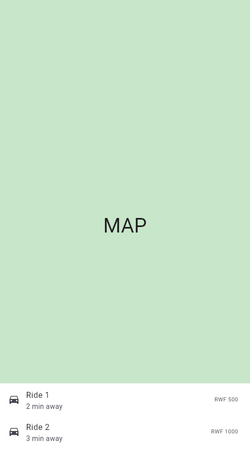
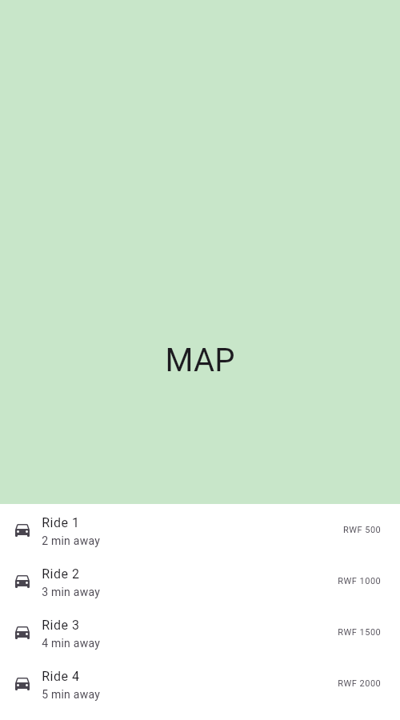
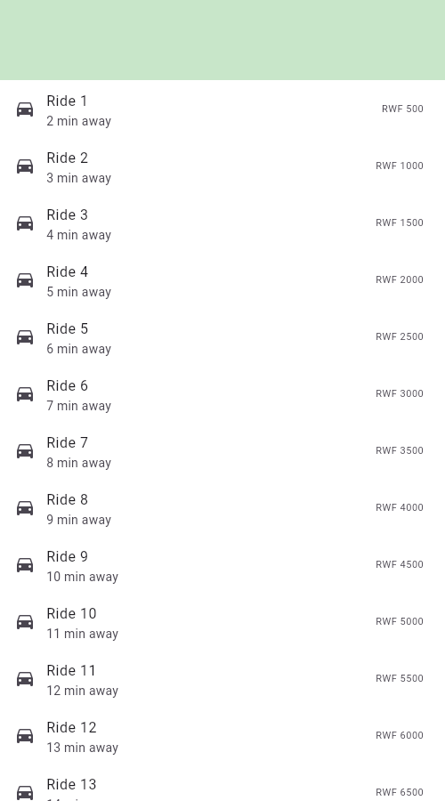

# DraggableScrollableSheet Demo

**`DraggableScrollableSheet` is a bottom panel that the user can drag up and down to resize, while its contents stay scrollable.**

Course: Mobile Application Development — widget presentation demo.

## The use case

A ride-hailing screen, like Uber or Bolt.

The map and the list of rides both need the same screen, and which one matters
more keeps changing. Checking the pickup point needs map; comparing prices needs
list. A fixed split wastes space either way, so the sheet lets the user choose
the split by dragging — and it never fully covers the map.

## Screenshot

The same app at the three sizes the attributes define:

| `minChildSize` (0.15) | `initialChildSize` (0.3) | `maxChildSize` (0.9) |
|---|---|---|
|  |  |  |
| Dragged all the way down | How the app first opens | Dragged all the way up |

## The three attributes

All three are **fractions of the parent's height** (`0.0`–`1.0`), not pixels,
so the same values work on any screen size.

| Attribute | Default | This demo | What it changes on screen |
|---|---|---|---|
| `initialChildSize` | `0.5` | `0.3` | How tall the sheet is when the screen first opens. At `0.3` about four rides are visible without touching anything. |
| `minChildSize` | `0.25` | `0.15` | The floor. Dragging down stops here, so the sheet can never be dismissed by accident — there is always something left to grab. |
| `maxChildSize` | `1.0` | `0.9` | The ceiling. Dragging up stops here. At `0.9` a strip of map stays visible instead of the sheet taking the whole screen. |

Flutter asserts `minChildSize <= initialChildSize <= maxChildSize`. Breaking
that order throws at runtime in debug mode.

To see each one change, edit the value in `lib/main.dart` and hot reload (`r`).

## Running it

```
flutter pub get
flutter run
```

To run it in a browser instead:

```
flutter run -d chrome
```

If the browser shows a blank page, CanvasKit is being blocked by the network.
Build it locally and serve it instead:

```
flutter build web --release --no-web-resources-cdn
cd build/web && python3 -m http.server 8111
```

Then open <http://127.0.0.1:8111>.

## Checks

```
flutter analyze
flutter test
```

## Notes

- `MaterialApp.scrollBehavior` adds `PointerDeviceKind.mouse` to `dragDevices`.
  Flutter disables mouse dragging on web by default, so without it the sheet
  cannot be dragged in a browser. It is not needed on a phone.
- The `builder` provides a `ScrollController` that must be passed to the
  `ListView`. That is what links scrolling the list and dragging the sheet into
  one continuous gesture.
- Attribute defaults above are from the Flutter SDK source:
  `packages/flutter/lib/src/widgets/draggable_scrollable_sheet.dart`.

Built with Flutter 3.47.5.
